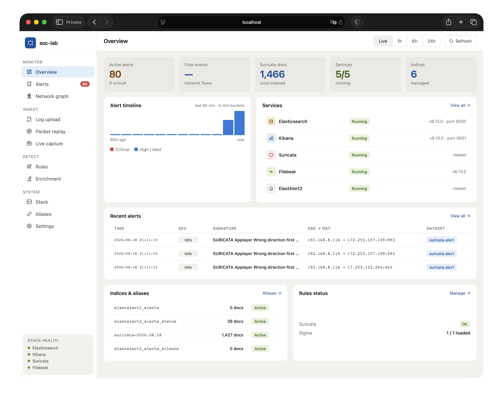
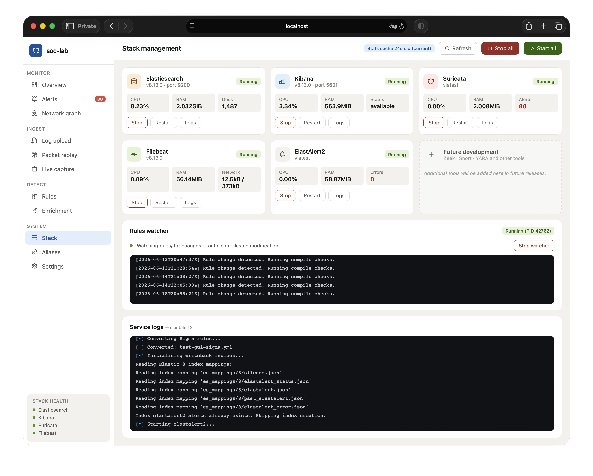
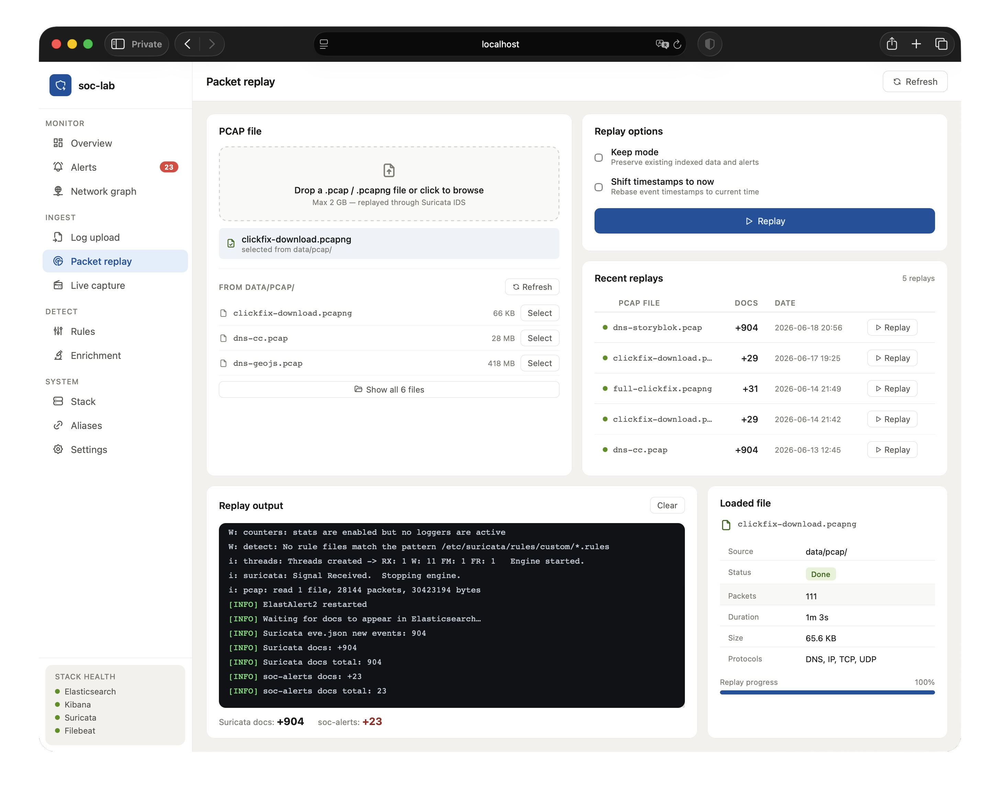
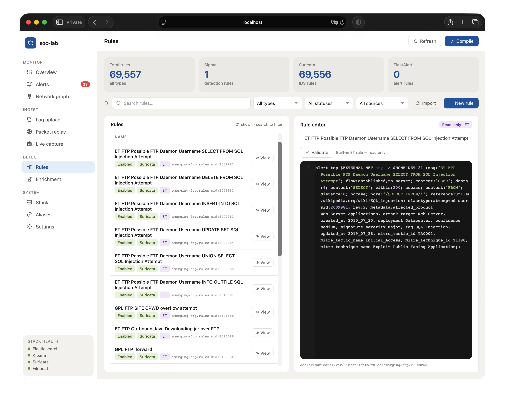
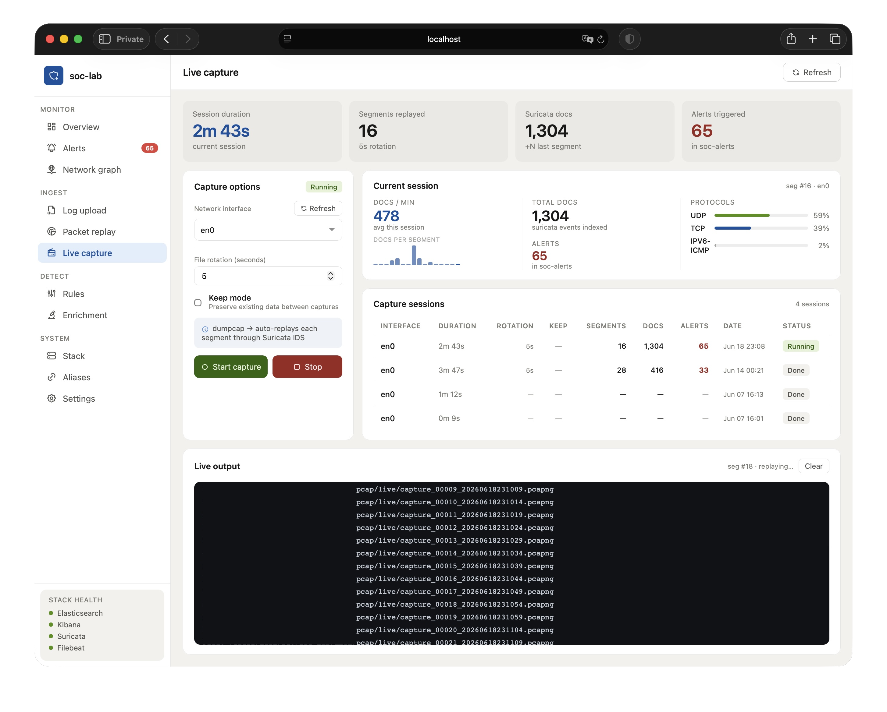

# SOC Lab

> Local SOC lab for experimenting with detection, packet replay, live capture, and enrichment workflows.




SOC Lab is a local security operations lab that approximates parts of a detection and analysis environment on a single machine. It combines containerized security tooling with a small FastAPI and Dash control plane so you can replay PCAPs, capture live traffic, test detection content, prototype log-ingest workflows, and experiment with Python-based enrichments against Elasticsearch.

## Current Capabilities

- Replay PCAPs through Suricata and index the resulting telemetry into Elasticsearch.
- Capture live traffic in rotating chunks and feed it back through the detection pipeline.
- Prototype generic log ingestion with preprocessing, pipeline selection, and optional AI-assisted pipeline generation.
- Manage rules, aliases, services, and enrichment runs from a simple web UI.
- Experiment with a Python enrichment SDK that supports audit logging and rollback.

## Project Maturity

SOC Lab is under active development. PCAP replay and live capture are the most complete workflows; generic log ingest, enrichment, and some UI behavior are still being refined.

| Area               | Status           | Notes                                                                                                            |
| ------------------ | ---------------- | ---------------------------------------------------------------------------------------------------------------- |
| PCAP replay        | Working          | Replays local `.pcap`/`.pcapng` files through Suricata and Filebeat into Elasticsearch.                          |
| Live capture       | Working          | Captures `dumpcap` chunks and replays them through the same Suricata/Filebeat pipeline.                          |
| Rule management    | Usable           | Supports rule inventory, validation, compile checks, and watcher-driven reload flows.                            |
| Generic log ingest | Work in progress | Core flow exists, but broad format coverage and edge-case behavior have not been fully tested.                   |
| Enrichment SDK     | Work in progress | SDK, audit, rollback, scheduler, and UI flows are under active iteration and should be treated as evolving APIs. |
| UI polish          | Work in progress | The web control plane is functional, but some layout/state bugs remain.                                          |

## Quick Start

`./start.sh` installs Python dependencies into a local `.venv`, starts the Docker stack, and launches the FastAPI and Dash processes.

```bash
./start.sh
```

Open:

- Dash UI: `http://127.0.0.1:8050`
- FastAPI API: `http://127.0.0.1:8000`
- Kibana: `http://localhost:5601`
- Elasticsearch: `http://localhost:9200`

Operational helpers:

```bash
./stop.sh
./restart.sh
./reset.sh
```

## Host Dependencies

The stack expects these host tools to already exist:

| Dependency            | Required | Used for                                                           | Notes                                                                                                                                                                  |
| --------------------- | -------- | ------------------------------------------------------------------ | ---------------------------------------------------------------------------------------------------------------------------------------------------------------------- |
| Docker                | Yes      | Running Elasticsearch, Kibana, Suricata, Filebeat, and ElastAlert2 | `start.sh`, `stop.sh`, and `reset.sh` all depend on a working Docker daemon.                                                                                           |
| Docker Compose v2     | Yes      | Bringing the stack up with `docker compose`                        | The repo uses the `docker compose` subcommand, not legacy `docker-compose`.                                                                                            |
| Python 3              | Yes      | FastAPI, Dash, repo automation, enrichment, ingest helpers         | `start.sh` creates `.venv` with `python3 -m venv`.                                                                                                                     |
| Python `venv` support | Yes      | Creating the local virtual environment                             | On some Linux distros this is a separate package such as `python3-venv`.                                                                                               |
| `curl`                | Yes      | Startup health checks for Elasticsearch and Kibana                 | Used directly in `start.sh` and throughout the ops docs.                                                                                                               |
| `lsof`                | Yes      | Killing stale host processes bound to UI/API ports                 | Used by `start.sh`, `stop.sh`, and `reset.sh`.                                                                                                                         |
| `dumpcap`             | Optional | Live capture mode                                                  | Required for the live capture workflow implemented in `core/capture/live.py` and exposed through the current UI/API flow. Installed with Wireshark or tshark packages. |
| `capinfos`            | Optional | Fast PCAP metadata inspection in the capture UI/API                | Used for packet count and duration in `/api/capture/pcap/info`. Usually installed with Wireshark.                                                                      |
| Ollama                | Optional | AI-generated ingest pipelines                                      | Required only for LLM-assisted pipeline generation/upload flows.                                                                                                       |
| `jq`                  | Optional | Pretty-printing JSON during manual verification and debugging      | Used in docs/examples, not required for the lab to run.                                                                                                                |

Feature notes:

- Basic lab startup needs only the required dependencies in the table.
- Live capture needs `dumpcap` permissions that allow your current user to run `dumpcap -D` successfully.
- PCAP replay from existing files does not require `dumpcap`, but the richer PCAP info view uses `capinfos` when available.
- AI pipeline generation is optional and only works when Ollama is running locally.

## Documentation

Current documentation set:

- `docs/README.md` - reading order and documentation map
- `docs/03-runtime-stack.md` - current startup and runtime behavior
- `docs/09-operations.md` - verification and troubleshooting commands

## Interface Highlights

<table>
  <tr>
    <td></td>
    <td></td>
  </tr>
  <tr>
    <td></td>
    <td></td>
  </tr>
</table>

## Enrichment SDK Quick Start

User scripts live under:

```text
data/enrichments/scripts/
```

They import the public SDK surface like this:

```python
from enrich_sdk import EnrichmentContext
```

Minimal example:

```python
from enrich_sdk import EnrichmentContext

def run(ctx: EnrichmentContext) -> None:
    ctx.update_by_query(
        index="soc-alerts",
        query={
            "bool": {
                "must": [{"term": {"event.dataset": "suricata.alert"}}],
                "must_not": [{"exists": {"field": "risk.score"}}],
            }
        },
        fields={
            "risk.score": 80,
            "risk.reason": "matched enrichment policy",
        },
    )
```

Important SDK semantics:

- `index_doc(...)` is create-only
- `update_doc(...)` mutates an existing document and creates missing fields if needed
- `search(...)` is for smaller result sets returned as a list
- `scan(...)` is for iterating larger result sets
- mutating methods write audit records into the central lab cluster
- field-level rollback supports update/remove style mutations

For the deeper docs, read:

- `docs/08-enrichment.md`
- `docs/10-enrichment-sdk-reference.md`
- `docs/11-enrichment-internals.md`

## What The System Is Trying To Do

At a very high level, SOC Lab takes security-relevant input and moves it through the same kinds of stages you would see in a real security analytics environment.

```text
raw input
  ├─ PCAP replay
  ├─ live network capture
  └─ generic log upload

       |
       v
normalization / ingestion
       |
       v
Elasticsearch indices and aliases
       |
       ├─ Kibana search and dashboards
       ├─ ElastAlert2 detections
       └─ enrichment scripts
```

The repo also gives you a web control plane on top of that runtime stack.

## Architecture In One Diagram

This diagram shows the host control plane, Docker services, bind mounts, and Elasticsearch data paths in one view. The UI and API run on the host; Elasticsearch, Kibana, Suricata, Filebeat, and ElastAlert2 run in Docker Compose.

```text
HOST MACHINE
┌───────────────────────────────────────────────────────────────────────┐
│ Browser                                                               │
│   ├─ http://127.0.0.1:8050  ───────────────► Dash UI                  │
│   │                                         ui/app.py + ui/pages/*    │
│   │                                                   │               │
│   │                                  api_get/post/delete over HTTP    │
│   │                                                   v               │
│   │                                         FastAPI :8000             │
│   │                                         api/main.py + routes/*    │
│   │                                                   │               │
│   │                                  imports service modules          │
│   │                                                   v               │
│   │                                         core/*                    │
│   │                            stack, capture, ingest, rules, enrich  │
│   │                                                   │               │
│   │                  Docker CLI / subprocess / HTTP / file writes     │
│   │                                                   v               │
│   └─ http://localhost:5601 ───────► Kibana UI                         │
└──────────────────────────────────────┬────────────────────────────────┘
                                       │
                                       │ host files + bind mounts
                                       v
┌───────────────────────────────────────────────────────────────────────┐
│ Repository data/config                                                │
│ data/pcap/                  uploaded PCAPs + live capture chunks      │
│ data/rules/suricata/        custom Suricata rules                     │
│ data/rules/sigma/           Sigma rules for ElastAlert2 conversion    │
│ data/ingest/                sample/uploaded logs                      │
│ data/pipelines/             ingest pipeline definitions               │
│ data/enrichments/           enrichment YAML config + Python scripts   │
│ runtime/logs/suricata/      shared eve.json output                    │
└─────────────┬─────────────────────────────────────────────────────────┘
              │
              │ bind-mounted into Docker services
              v
DOCKER COMPOSE NETWORK
┌────────────────────┐       HTTP :9200       ┌─────────────────────────┐
│ Kibana :5601       │ ─────────────────────► │ Elasticsearch :9200     │
│ data views/search  │ ◄───────────────────── │ indices, aliases,       │
└────────────────────┘       JSON results     │ templates, pipelines    │
                                              │                         │
┌────────────────────┐  writes eve.json       │ important indices:      │
│ Suricata           │ ─────────────────────┐ │ suricata-*              │
│ replay IDS engine  │                      │ │ soc-alerts              │
│ reads /pcap +      │                      │ │ elastalert2_alerts*     │
│ rule bind mounts   │                      │ │ enrichment audit-*      │
└─────────▲──────────┘                      │ └───────────▲─────────────┘
          │                                 │             │
          │ docker exec suricata -r <pcap>  │             │ bulk/search/update
          │                                 v             │
┌─────────┴──────────┐              ┌─────────────────────┴─────────────┐
│ PCAP workflows     │              │ Filebeat                          │
│ packet replay      │              │ tails /var/log/suricata/eve.json  │
│ live capture chunks│              │ indexes through suricata.common   │
└────────────────────┘              └───────────────────────────────────┘

┌────────────────────┐       search/write      ┌────────────────────────┐
│ ElastAlert2        │ ───────────────────────►│ Elasticsearch          │
│ static + Sigma     │ ◄────────────────────── │ scheduled rule queries │
│ generated rules    │       query results     │ writes alert docs      │
└────────────────────┘                         └────────────────────────┘

FastAPI also talks to Elasticsearch and Kibana directly from the host for
search pages, aliases, log uploads, ingest pipelines, Kibana data views,
enrichment runs, audit records, rollback, and service health. The
enrichment scheduler runs inside the FastAPI process.
```

## Main Data Paths

### Path 1: PCAP replay

```text
PCAP file
  -> docker exec suricata suricata -r <pcap>
  -> Suricata writes events to eve.json
  -> Filebeat tails eve.json
  -> Filebeat bulk-indexes events into Elasticsearch
  -> Kibana and the SOC Lab UI can query them
  -> ElastAlert2 later queries them and may write alerts
```

### Path 2: Live capture

```text
host interface
  -> dumpcap writes rotating .pcapng chunks
  -> SOC Lab queue logic notices completed chunks
  -> each chunk is replayed through Suricata
  -> eve.json updates
  -> Filebeat ships events
  -> Elasticsearch stores them
```

### Path 3: Generic log upload

```text
uploaded or local log file
  -> preprocess / detect format
  -> optional ingest pipeline selection or generation
  -> bulk ingest into Elasticsearch
  -> Kibana data view creation
  -> searchable in Kibana and the Dash UI
```

### Path 4: Enrichment

```text
UI/API request
  -> enrichment runner
  -> target cluster client
  -> script run(ctx) or run(ctx, params)
  -> document reads/writes on target ES cluster
  -> audit record written to central lab cluster
```

## Repository Structure

This is the current repo snapshot in a `tree`-style layout. It is meant to help a new human or LLM understand where responsibilities live.

```text
soc-lab/
├── api/
│   ├── main.py                  # FastAPI app entry point and router registration
│   ├── models.py                # Pydantic request/response models
│   ├── utils.py                 # API error helpers
│   └── routes/
│       ├── alerts.py            # alert search and aggregations
│       ├── capture.py           # PCAP replay, live capture, upload, pipeline endpoints
│       ├── enrichment.py        # enrichment run, cluster, audit, rollback endpoints
│       ├── indices.py           # alias and index inventory / mutation endpoints
│       ├── network.py           # Suricata flow queries and summaries
│       ├── overview.py          # dashboard summary endpoint
│       ├── rules.py             # rule inventory, edit, validate, compile, watcher endpoints
│       └── stack.py             # stack control, service logs, service status
├── config/
│   ├── elastalert2/
│   │   ├── elastalert2.yml      # ElastAlert2 runtime configuration
│   │   └── rules/               # static native ElastAlert2 rules
│   ├── filebeat/
│   │   └── filebeat.yml         # Filebeat input/output shipping config
│   └── suricata/
│       ├── suricata.yaml        # main Suricata configuration
│       └── threshold.config     # alert suppression settings
├── core/
│   ├── capture/
│   │   ├── live.py              # live capture orchestration
│   │   └── replay.py            # PCAP replay orchestration
│   ├── elastic/
│   │   ├── aliases.py           # alias management and Kibana data views
│   │   ├── client.py            # Elasticsearch client factory
│   │   ├── kibana.py            # Kibana REST helper wrapper
│   │   └── loader.py            # Security Onion template/pipeline loader
│   ├── enrich/
│   │   ├── audit.py             # enrichment audit write/read helpers
│   │   ├── clusters.py          # enrichment cluster config loader and routing
│   │   ├── context.py           # main enrichment SDK implementation
│   │   ├── rollback.py          # field-level rollback engine
│   │   ├── runner.py            # enrichment orchestration from config to execution
│   │   ├── scheduler.py         # in-process enrichment scheduler
│   │   ├── scripts.py           # dynamic enrichment script loader
│   │   ├── validation.py        # enrichment config/script validation helpers
│   │   └── utils.py             # enrichment field/query helpers
│   ├── ingest/
│   │   ├── bulk.py              # bulk ingest helpers
│   │   ├── llm.py               # Ollama/LLM workflow wrapper
│   │   ├── pipeline.py          # ingest pipeline lookup and upload
│   │   ├── pipeline_gen.py      # ingest pipeline generation logic
│   │   ├── preprocess.py        # decompress / detect / normalize inputs
│   │   └── upload.py            # high-level upload orchestration
│   ├── rules/
│   │   └── compile.py           # rules compile checks and watcher lifecycle
│   ├── stack/
│   │   ├── docker.py            # Docker service inventory helpers
│   │   ├── health.py            # stack health aggregation
│   │   └── runtime.py           # stack lifecycle and service control
│   ├── confirm.py               # y/N prompt helper for destructive operations
│   └── settings.py              # repo paths and URL/port configuration helpers
├── data/
│   ├── enrichments/
│   │   ├── config/              # enrichment cluster and run config
│   │   └── scripts/             # user enrichment scripts
│   ├── ingest/                  # sample/uploaded logs for ingest testing
│   ├── pcap/                    # replay PCAPs and live capture artifacts
│   ├── pipelines/               # built-in, custom, and generated ingest pipelines
│   └── rules/                   # user-editable Suricata and Sigma rules
├── docker/
│   ├── elastalert-start.sh      # ElastAlert2 container entrypoint
│   └── suricata-start.sh        # Suricata container entrypoint
├── docs/
│   ├── images/                  # README screenshots
│   ├── README.md                # documentation reading order
│   ├── 01-system-overview.md    # system overview
│   ├── 02-repo-map.md           # repo map and file roles
│   ├── 03-runtime-stack.md      # runtime stack and startup behavior
│   ├── 04-backend-services.md   # backend service module guide
│   ├── 05-api-reference.md      # FastAPI route reference
│   ├── 06-ui-guide.md           # Dash UI structure and patterns
│   ├── 07-data-flows.md         # end-to-end data flows
│   ├── 08-enrichment.md         # enrichment architecture
│   ├── 09-operations.md         # verification and troubleshooting
│   ├── 10-enrichment-sdk-reference.md
│   └── 11-enrichment-internals.md
├── runtime/                     # runtime logs and generated status files
├── enrich_sdk/
│   └── __init__.py              # public enrichment SDK import surface
├── ui/
│   ├── app.py                   # Dash app entry point
│   ├── helpers.py               # API wrappers and shared UI components
│   ├── assets/style.css         # global CSS styling
│   └── pages/
│       ├── overview.py          # dashboard page
│       ├── alerts.py            # alert search page
│       ├── network.py           # network graph page
│       ├── ingest.py            # generic log upload page
│       ├── capture_pcap.py      # packet replay page callbacks
│       ├── capture_pcap_widgets.py
│       ├── capture_live.py      # live capture page
│       ├── rules.py             # rules page callbacks
│       ├── rules_editor.py      # rules editor layout helpers
│       ├── enrichment.py        # enrichment page callbacks
│       ├── enrichment_layout.py # enrichment page layout helpers
│       ├── stack.py             # stack management page
│       ├── aliases.py           # aliases page
│       └── settings.py          # settings page
├── compose.yml                  # Docker Compose definition for the lab stack
├── requirements.txt             # Python package requirements
├── start.sh                     # start Docker stack + FastAPI + Dash + watcher
├── stop.sh                      # stop host-run web processes and Docker stack
├── restart.sh                   # restart helper
├── reset.sh                     # destructive reset helper
├── LICENSE                      # AGPLv3 license text
├── EXPLANATION.md               # older very detailed conceptual deep dive
├── WEB_MIGRATION_DESIGN.md      # web migration architecture notes
└── ENRICHMENT_DESIGN.md         # enrichment design notes and decisions
```

## Documentation Index

The main long-form documentation now lives under `docs/`.

- `docs/README.md` - reading order and documentation map
- `docs/01-system-overview.md` - big-picture architecture and component roles
- `docs/02-repo-map.md` - repo tree and file-role guide
- `docs/03-runtime-stack.md` - Docker stack, startup scripts, config, and runtime state
- `docs/04-backend-services.md` - explanation of `core/` service modules
- `docs/05-api-reference.md` - FastAPI structure and route-to-service mapping
- `docs/06-ui-guide.md` - Dash structure, helper patterns, and page behavior
- `docs/07-data-flows.md` - end-to-end workflow diagrams and low-level behavior
- `docs/08-enrichment.md` - enrichment subsystem deep dive
- `docs/09-operations.md` - debugging and operational verification
- `docs/10-enrichment-sdk-reference.md` - method-level enrichment SDK reference
- `docs/11-enrichment-internals.md` - low-level implementation walkthrough of `core/enrich/*`
